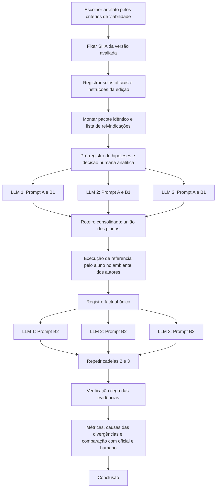

# Novo protocolo experimental: LLMs reproduzem a avaliação oficial de artefatos (selos F e R)?

Este protocolo substitui o usado na T7, corrigindo os problemas apontados em `avaliacao_critica.md`. Ele foi desenhado para caber no escopo da tarefa (um artefato, três LLMs de três provedores, avaliação analítica e avaliação por execução com cada LLM) e ser executável por um aluno ou uma dupla. Extensões opcionais, para quem quiser resultados mais generalizáveis, estão marcadas como **[Opcional]**.

---

## 1. Objetivo, perguntas e hipóteses

**Objetivo (da tarefa):** investigar se LLMs de provedores diferentes, seguindo as instruções oficiais da edição, reproduzem os selos F e R atribuídos ao artefato, e se a análise documental é consistente com a execução prática.

| Pergunta | Formulação operacional |
|---|---|
| Q1 | A decisão analítica (sem execução) de cada LLM coincide com o selo oficial? |
| Q2 | Ao receber evidências reais de execução, a LLM confirma, revisa ou contradiz a decisão analítica? A decisão final se aproxima do oficial? |
| Q3 | As três LLMs concordam entre si quando recebem exatamente as mesmas entradas? |
| Q4 | As evidências citadas pelas LLMs existem e sustentam o que elas afirmam? |

Hipóteses registradas **antes** da coleta (escreva as suas no arquivo `preregistro.md` e não as altere depois):

- H1: na etapa analítica, as LLMs tendem a "Indeterminado" para F, porque as instruções oficiais exigem prova de execução.
- H2: com o mesmo registro de execução bem-sucedida, as três LLMs convergem para a mesma decisão de F.
- H3: as divergências em R se explicam principalmente pela interpretação de "principais reivindicações", e diminuem quando a lista de reivindicações é fixada previamente.

---

## 2. Princípio central do desenho: separar quem executa de quem julga

No protocolo anterior, a única LLM que "executou" também foi a única que atribuiu F, de modo que não se sabia se o efeito era do modelo ou da execução. Neste protocolo:

1. **Todas as LLMs recebem as mesmas entradas em todas as etapas.** Na etapa analítica, o mesmo pacote de arquivos. Na etapa por execução, o **mesmo registro de execução**.
2. **A execução é feita uma vez, pelo aluno, em ambiente que atende aos requisitos dos autores**, seguindo os procedimentos dos autores e cobrindo a **união dos passos** propostos pelos planos das três LLMs. Assim, cada LLM tem seu plano executado (item 5 da tarefa), e nenhuma recebe mais evidência que a outra.
3. **Simulação não substitui execução.** Se a execução for impossível mesmo no ambiente dos autores, isso é registrado como resultado ("execução bloqueada, motivo X"), e as LLMs recebem esse registro factual como qualquer outro.

<!-- FIG:antesdepois -->

**[Opcional] Condição agêntica.** Em uma condição separada, cada LLM executa o artefato sozinha, por meio do seu agente de linha de comando (Codex CLI, Claude Code, Gemini CLI), **dentro do mesmo contêiner ou VM, partindo da mesma imagem**. Os resultados dessa condição são reportados à parte e nunca misturados com a condição principal.

---

## 3. Desenho experimental

| Fator | Níveis |
|---|---|
| LLM | 3 (OpenAI, Anthropic, Google), versão e nível de raciocínio registrados |
| Etapa | A (analítica) e B (por execução, com registro comum) |
| Selo | F e R |
| Repetição | 3 cadeias independentes por LLM (conversa nova a cada cadeia, memória desativada) |

Cada **cadeia** é: Prompt A → Prompt B1 (plano) → [execução comum pelo aluno] → Prompt B2 (decisão após execução), na mesma conversa. Total: 3 LLMs × 3 cadeias × 2 etapas × 2 selos = **36 decisões por artefato**, contra 6 decisões finais por artefato, sem repetição, no protocolo anterior.

A execução prática é feita **uma vez** (com a união dos planos); a repetição recai apenas sobre o julgamento, que é barato.

Linha de base humana: antes de abrir qualquer resposta de LLM, o aluno (ou cada membro da dupla, separadamente) registra sua própria decisão analítica F/R. Depois da execução, registra a decisão final. Isso responde se a dificuldade é do artefato ou dos modelos.

<!-- FIG:cadeias -->

### 3.1 Parâmetros e valores dos experimentos

Esta tabela é a referência única do que varia, do que fica fixo e do que se mede. Copie-a para `preregistro.md`, preencha a coluna "Valor adotado" antes da coleta e não a altere depois; qualquer mudança vira desvio registrado.

<!-- PARAMS -->

| Grupo | Parâmetro | Valor ou níveis recomendados | Valor adotado | Onde registrar |
|---|---|---|---|---|
| Fator (varia) | LLM / provedor | 3 níveis: OpenAI, Anthropic, Google | | `llms.md` |
| Fator (varia) | Etapa | A (analítica), B (após execução) | | `decisoes.csv` |
| Fator (varia) | Selo | F, R | | `decisoes.csv` |
| Fator (varia) | Cadeia (repetição) | 1, 2, 3 (conversa nova a cada uma) | | `decisoes.csv` |
| Fator (opcional) | Condição agêntica | sim / não; se sim, mesma imagem de contêiner ou VM para as três | | `llms.md` |
| Controlado (fixo) | Artefato e edição | um artefato do SBSeg ou SBRC; edição e título | | `versao.md` |
| Controlado (fixo) | Versão do artefato | SHA do commit avaliado pelo comitê (tag, Zenodo ou data) | | `versao.md` |
| Controlado (fixo) | Pacote de entrada | artigo.pdf, artefato.zip, instrucoes-oficiais.md, reivindicacoes.md; hash em `MANIFESTO.sha256` | | `pacote/` |
| Controlado (fixo) | Lista de reivindicações | C1 a Cn, com localização no artigo e resultado esperado | | `reivindicacoes.md` |
| Controlado (fixo) | Regra para R | reivindicações indicadas pelos autores no README ou, na falta, C1 a Cn | | `reivindicacoes.md` |
| Controlado (fixo) | Modelo e versão | nome e versão exibidos pela interface; data e hora de cada cadeia | | `llms.md` |
| Controlado (fixo) | Nível de raciocínio | o mesmo nível nominal para as três (por exemplo, médio ou o padrão da interface) | | `llms.md` |
| Controlado (fixo) | Interface | chat com upload de arquivos para as três | | `llms.md` |
| Controlado (fixo) | Navegação web | desativada (ou proibida no prompt, se não for possível desativar) | | `llms.md` |
| Controlado (fixo) | Memória e personalização | desativadas | | `llms.md` |
| Controlado (fixo) | Temperatura (só via API) | padrão do provedor, registrada; não alterar entre cadeias | | `llms.md` |
| Controlado (fixo) | Prompts | A, B1 e B2 com texto idêntico; só os campos entre chaves mudam | | `pacote/prompts/` |
| Controlado (fixo) | Informação vedada às LLMs | selos oficiais, respostas de outras LLMs, conversas de planejamento | | `preregistro.md` |
| Execução | Ambiente | o indicado pelos autores (VM dos autores, distribuição e versão do SO) | | `registro-factual.md` |
| Execução | Recursos da máquina | CPU, RAM e disco iguais ou superiores aos requisitos do README | | `registro-factual.md` |
| Execução | Versões das dependências | saída de `--version` de compilador, interpretador e bibliotecas | | `registro-factual.md` |
| Execução | Tempo máximo por reivindicação | 2 h (ajustar ao tempo informado pelos autores) | | `roteiro-consolidado.md` |
| Execução | Critério de desistência | erro não documentado que exija desvio D2 em passo essencial, ou tempo máximo atingido | | `roteiro-consolidado.md` |
| Execução | Classes de desvio | D0 a D3 (seção 6.3) | | `registro-factual.md` |
| Execução | Tolerância numérica | diferença relativa aceita em relação ao resultado publicado (por exemplo, 5%), ou a tolerância declarada pelos autores | | `reivindicacoes.md` |
| Execução | Contato com autores | no máximo 1 mensagem, com prazo de resposta (por exemplo, 5 dias) | | `registro-factual.md` |
| Medida (resposta) | Decisão | Atribuir, Não atribuir, Indeterminado | | `decisoes.csv` |
| Medida (resposta) | Confiança | 0 a 100 | | `decisoes.csv` |
| Medida (resposta) | Evidências citadas | lista arquivo:local, classificada como correta, mal interpretada, inexistente ou não verificável | | `evidencias.csv` |
| Medida (resposta) | Arquivos efetivamente lidos | lista declarada pela LLM na seção A | | conversas exportadas |
| Medida (resposta) | Status por passo | sucesso, falha, inconclusivo | | `registro-factual.md` |
| Medida (resposta) | Tempo e custo | duração de cada conversa e de cada passo de execução | | `decisoes.csv`, `terminal.log` |
| Limiar de decisão | Consistência com o oficial | decisão modal = oficial e estabilidade ≥ 2/3 | | `preregistro.md` |
| Limiar de decisão | Consistência entre LLMs | as três com a mesma decisão modal | | `preregistro.md` |
| Limiar de decisão | Reprodução de uma reivindicação | resultado dentro da tolerância numérica ou comportamento descrito observado | | `preregistro.md` |


---

## 4. Fase 0: preparação (antes de qualquer LLM)

### 4.1 Escolha do artefato

Use esta lista de verificação. Escolha um artefato que satisfaça todos os itens obrigatórios.

| Critério | Obrigatório? |
|---|---|
| Está na página de resultados de uma edição do SBSeg ou SBRC em doc-artefatos.github.io | Sim |
| O ambiente exigido pelos autores está disponível para você (por exemplo, Linux nativo, VM do VirtualBox com a RAM pedida, Docker, GPU se necessária) | Sim |
| O tempo de execução do teste mínimo e do experimento principal, segundo os autores, cabe no prazo | Sim |
| Não depende de credencial paga ou de serviço indisponível para as reivindicações principais | Sim |
| Há ao menos um selo negado (por exemplo, F e R não atribuídos, ou só R negado) | Desejável: torna a comparação informativa, pois um artefato com todos os selos não distingue um avaliador criterioso de um que aprova tudo |

Se o artefato já escolhido for Foremost-NG ou Mininet-GUI, veja a seção 12.

### 4.2 Fixação da versão

1. Identifique a versão avaliada pelo comitê: tag ou release próxima da data da rodada de avaliação, DOI do Zenodo citado no artigo ou no apêndice, ou o último commit anterior à data de divulgação dos resultados.
2. Registre o SHA do commit em `versao.md`, com a justificativa de por que essa é a versão avaliada.
3. Gere o arquivo do repositório: `git archive --format=zip -o pacote/artefato.zip <SHA>`.
4. Se a versão atual do repositório for diferente, registre as diferenças relevantes (README, scripts, dados) com `git diff <SHA> HEAD --stat`.

### 4.3 Pacote de entrada idêntico

Monte a pasta `pacote/` e não a altere depois:

```
pacote/
  artigo.pdf                 # versão publicada (DOI)
  artefato.zip               # git archive do SHA fixado
  instrucoes-oficiais.md     # texto integral da página revinstrucoes da edição
  reivindicacoes.md          # lista fixada na seção 4.4
  MANIFESTO.sha256           # sha256sum de todos os arquivos acima
```

Salve também um snapshot datado da página de resultados (PDF impresso ou link do archive.org) em `referencia/selos-oficiais.pdf`. Esse arquivo **nunca** é mostrado às LLMs.

### 4.4 Lista fixada de reivindicações principais

Antes de consultar qualquer LLM, leia o artigo e preencha `reivindicacoes.md`:

| ID | Reivindicação | Onde está no artigo | Resultado esperado (número, figura, tabela, comportamento) | O README indica como reproduzir? (sim, parcial, não) |
|---|---|---|---|---|
| C1 | ... | Seção 4, Figura 2 | ... | ... |

Regra para R (escrita aqui e entregue às LLMs): *"R é atribuído se as reivindicações marcadas como principais pelos autores no README (ou, na falta dessa marcação, as reivindicações C1 a Cn desta lista) forem reproduzidas"*. Isso remove a divergência observada no Mininet-GUI, em que uma LLM exigiu todas as contribuições do artigo e outra aceitou o subconjunto indicado pelos autores. Se você discordar da regra, registre isso, mas mantenha-a igual para as três LLMs.

### 4.5 Insumos externos

Procure, antes da execução, os dados necessários às reivindicações (por exemplo, imagens de disco, datasets, chaves de API) no README, no Zenodo, nas issues e nos releases. Se algo faltar, você pode enviar uma única mensagem aos autores pedindo o insumo (isso imita o rebuttal do processo oficial). Registre a pergunta, a data e a resposta. Se o insumo chegar, ele entra no pacote de execução para todas as LLMs.

### 4.6 Configuração das LLMs

Registre em `llms.md`, para cada uma: provedor, nome e versão do modelo exibidos, nível de raciocínio, interface, data e hora de cada cadeia.

Controle de condições:

- Mesmo tipo de interface para as três na condição principal: chat com upload de arquivos. Se uma delas não aceitar o ZIP, extraia os mesmos arquivos para as três.
- **Navegação na web desativada** (ou, se não for possível desativar em alguma, instrução explícita no prompt para não navegar). As três leem somente o pacote.
- Memória e personalização desativadas; conversa nova a cada cadeia.
- Nunca informar os selos oficiais nem resultados de outras LLMs.
- Não usar conversas em que o estudo foi planejado ou discutido.

---

## 5. Etapa A: avaliação analítica

Anexe o pacote e envie o Prompt A sem alterações, a não ser nos campos entre chaves.

### Prompt A

```
Atue como revisor do Comitê de Avaliação de Artefatos do {EVENTO EDIÇÃO}. Avalie somente os selos Funcional (F) e Reprodutível (R), seguindo exatamente as instruções oficiais anexadas (instrucoes-oficiais.md).

MATERIAL
Use exclusivamente os arquivos anexados: artigo.pdf (fonte das reivindicações), artefato.zip (o artefato, na versão {SHA}), instrucoes-oficiais.md e reivindicacoes.md (lista de reivindicações principais e regra para o selo R). Não navegue na web. Se precisar de algo que não está nos anexos, registre como evidência ausente.

TAREFA
Esta é uma avaliação analítica: você não executou o artefato e não deve afirmar que algo funcionou.

Para cada selo:
1. Liste os critérios oficiais aplicáveis, citando o trecho das instruções.
2. Para cada critério, indique: atendido na documentação, não atendido, ou só verificável por execução.
3. Cite cada evidência no formato [arquivo:seção ou linha] e transcreva o trecho curto que a sustenta.
4. Decida: Atribuir, Não atribuir ou Indeterminado, usando esta regra:
   - Não atribuir: há evidência de que um critério obrigatório não é atendido (por exemplo, falta o dado necessário para uma reivindicação principal).
   - Indeterminado: nenhum critério obrigatório falha na documentação, mas a decisão depende de execução.
   - Atribuir: somente se os critérios estiverem atendidos com evidência suficiente para isso.
5. Informe sua confiança de 0 a 100 de que o comitê oficial atribuiu o selo.
6. Liste o que precisaria ser observado na execução para mudar sua decisão.

Para R, avalie cada reivindicação de reivindicacoes.md separadamente.

FORMATO
Responda em texto com as seções: A. Materiais examinados (liste os arquivos que você efetivamente abriu); B. Selo F; C. Selo R (por reivindicação); D. Lacunas e riscos.
Ao final, inclua um bloco JSON exatamente neste formato:
{"F": {"decisao": "...", "confianca": 0, "evidencias": ["arquivo:local", "..."]},
 "R": {"decisao": "...", "confianca": 0, "evidencias": ["..."],
       "por_reivindicacao": {"C1": "reproduzivel|nao_reproduzivel|depende_execucao"}}}
```

Mudanças em relação ao Prompt 1 anterior: material fechado e idêntico; regra explícita que distingue "Não atribuir" de "Indeterminado"; confiança numérica (permite comparar calibração); lista de arquivos efetivamente abertos (mostra se a LLM leu tudo); saída em JSON (facilita tabular as 36 decisões).

---

## 6. Etapa B: avaliação por execução

### 6.1 Prompt B1: plano de execução (mesma conversa)

```
Com base no mesmo material, produza o roteiro para que eu execute o artefato e verifique F e R. Não afirme que executou nada.

Siga somente os procedimentos fornecidos pelos autores. Quando um passo não estiver documentado pelos autores, marque-o como [NÃO DOCUMENTADO] e justifique por que ele é necessário.

Para cada passo: identificador (P1, P2...), selo e reivindicação relacionados, diretório, comando exato, resultado esperado segundo os autores, evidência a salvar, critério de sucesso, critério de falha e critério de interrupção.

Inclua: requisitos de hardware e software do ambiente; teste mínimo (F); um bloco por reivindicação de reivindicacoes.md (R); tempo estimado.
Ao final, uma tabela com todos os passos.
```

### 6.2 Consolidação do roteiro único

Depois de receber o plano das três LLMs na cadeia 1:

1. Monte `execucao/roteiro-consolidado.md` com a **união** dos passos, mantendo a origem de cada um (por exemplo, "P3: proposto por OpenAI e Google").
2. Marque os passos [NÃO DOCUMENTADO]. Eles são executados, mas em seção separada do registro, como desvios declarados.
3. Defina um tempo máximo por reivindicação (por exemplo, 2 horas) e o critério de desistência.

### 6.3 Execução de referência (aluno)

**Ambiente.** O indicado pelos autores. Se os autores fornecem VM, use a VM. Se indicam uma distribuição Linux, use essa distribuição em VM limpa. Registre: sistema operacional, kernel, CPU, RAM, disco, versões das dependências (`gcc --version`, `python3 --version`, `node --version` etc.) e se o ambiente atende aos requisitos do README. Não use ambiente diferente sem registrar o motivo; uma falha num ambiente fora dos requisitos não é evidência contra o artefato.

**Registro.** Grave toda a sessão de terminal (`script -t 2>execucao/tempo.log execucao/terminal.log` ou `asciinema rec`). Para cada passo, salve: comando, diretório, código de saída, tempo, trecho relevante da saída e hashes dos arquivos gerados (`sha256sum`). Para interfaces gráficas, capturas de tela com data e hora.

**Classificação de desvios.**

| Código | Significado | Efeito |
|---|---|---|
| D0 | Seguiu exatamente a documentação | Nenhum |
| D1 | Correção trivial e óbvia (por exemplo, instalar pacote listado com outro nome na distribuição) | Registrar |
| D2 | Contorno não documentado necessário para prosseguir | Registrar e informar às LLMs como desvio |
| D3 | Passo de origem externa (por exemplo, dataset público escolhido por você, como o DFTT) | Registrar como evidência complementar, não como reprodução de reivindicação |

**Comparação com o esperado.** Para cada reivindicação, compare o resultado obtido com o publicado (número, figura, tabela). Para resultados quantitativos, registre diferença absoluta e relativa. Para recuperação de arquivos ou detecção, compare com o gabarito (quantos esperados, quantos obtidos, quantos corretos), não apenas a contagem.

**Saída da etapa.** Um único arquivo `execucao/registro-factual.md`, com o mesmo conteúdo para as três LLMs, contendo: ambiente; tabela de passos (passo, origem, comando, esperado, observado, evidência, status sucesso/falha/inconclusivo, desvio D0 a D3); resultados por reivindicação; insumos ausentes e respostas dos autores. O registro descreve fatos; não contém sua opinião sobre os selos.

### 6.4 Prompt B2: decisão após execução (mesma conversa, para as três cadeias de cada LLM)

```
Segue em anexo o registro factual da execução do artefato (registro-factual.md), feita em ambiente que {atende / não atende, motivo} aos requisitos dos autores. O roteiro executado consolidou os planos de três revisores, incluindo o seu.

Com base no registro e no material anterior:
1. Para cada passo relevante, diga se o resultado confirma, contradiz ou não altera sua avaliação analítica.
2. Decida novamente F e R (Atribuir, Não atribuir ou Indeterminado) com a mesma regra de antes. Use Indeterminado somente se faltar evidência que o registro não fornece; diga exatamente qual.
3. Trate passos marcados D2 e D3 como evidência complementar, não como reprodução das reivindicações dos autores.
4. Informe confiança de 0 a 100 e explique a mudança em relação à decisão analítica, se houver.
Repita o bloco JSON da etapa A com as novas decisões e acrescente "mudou": true/false para cada selo.
```

Observação: o Prompt 3 anterior (simulação) mandava marcar "Indeterminado" sempre que a decisão dependesse de execução, o que fabricava mudanças de decisão. Ele não é usado aqui.

### 6.5 Repetições

Repita Prompt A, B1 e B2 em mais duas conversas novas por LLM (cadeias 2 e 3), usando **o mesmo registro factual**. Os planos das cadeias 2 e 3 são guardados para análise, mas só precisam ser executados se contiverem um passo essencial que não estava no roteiro consolidado; nesse caso, execute-o, acrescente ao registro e reenvie o registro atualizado a todas as cadeias.

---

## 7. Verificação das evidências citadas (item 9 da tarefa)

1. Peça a um colega que renomeie as respostas como M1, M2 e M3, sem indicar o provedor (verificação cega).
2. Extraia todas as evidências citadas em `evidencias.csv`.
3. Classifique cada uma abrindo o arquivo no SHA fixado:

| Classe | Definição |
|---|---|
| Correta | Existe e sustenta a afirmação |
| Mal interpretada | Existe, mas não sustenta a afirmação |
| Inexistente | Arquivo, seção ou trecho não existe (alucinação) |
| Não verificável | Referência vaga demais para conferir |

4. Só depois revele os provedores.

---

## 8. Métricas e análise

Todas descritivas; com um artefato, não há base para testes estatísticos, e o relatório deve dizer isso.

| Medida | Como calcular | Responde |
|---|---|---|
| Decisão modal | Decisão mais frequente nas 3 cadeias, por LLM, etapa e selo | Q1, Q2 |
| Estabilidade | Número de cadeias com a decisão modal (3/3, 2/3, 1/3) | Robustez de cada resposta |
| Cobertura | Proporção de decisões diferentes de Indeterminado | Distingue abstenção de erro |
| Concordância com o oficial | Decisão modal igual ao selo oficial (Atribuir = Atribuir; não atribuído = Não atribuir) | Q1, Q2 |
| Matriz de transição A → B | Contagem de pares (decisão analítica, decisão após execução) | Q2, item 12 |
| Concordância entre LLMs | Proporção de pares de LLMs com mesma decisão modal, por etapa e selo | Q3 |
| Precisão das evidências | Corretas / total citadas, por LLM | Q4 |
| Calibração | Confiança média quando acertou versus quando errou | Qualidade do julgamento |
| Linha de base humana | Decisão do aluno versus oficial e versus LLMs | Teto realista |

**Classificação obrigatória de cada divergência com o oficial.** Para cada decisão modal que diverge do selo oficial, atribua uma causa:

<!-- FIG:causas -->

| Causa | Exemplo |
|---|---|
| Erro de julgamento da LLM | Ignorou uma evidência existente e correta |
| Interpretação do critério | Exigiu todas as contribuições do artigo em vez das indicadas pelos autores |
| Insumo indisponível publicamente | Dado entregue ao comitê no rebuttal ou removido do repositório |
| Diferença de versão | O README do SHA atual difere do avaliado |
| Ambiente | Falha atribuível ao ambiente, não ao artefato |
| Possível erro do comitê | A evidência pública não sustenta o selo atribuído |

Isso evita a conclusão automática "a LLM errou" quando a divergência tem outra origem.

**Critério de consistência (definido antes da coleta).** Uma LLM é considerada consistente com a avaliação oficial em um selo quando sua decisão modal após execução coincide com o oficial e a estabilidade é de pelo menos 2/3. As LLMs são consideradas consistentes entre si quando as três têm a mesma decisão modal.

---

## 9. Tabelas a entregar

**Tabela comparativa (item 10 da tarefa):**

| LLM | Selo | Oficial | Analítica (modal, estabilidade) | Após execução (modal, estabilidade) | Coincide (A / B) | Mudou? | Causa da divergência | Evidência-chave |
|---|---|---|---|---|---|---|---|---|
| OpenAI | F | ... | Indet. (3/3) | Atribuir (3/3) | Não / Sim | Sim | n.a. | P4: teste mínimo, saída 0 |

Acrescente uma linha "Humano" por selo.

**Execução confirma ou contradiz (item 12):**

| LLM | Selo | Decisão A | Decisão B | Relação | Passo do registro que motivou |
|---|---|---|---|---|---|
| ... | F | Indet. | Atribuir | Resolveu incerteza | P4, P5 |

Use as categorias: confirma (A = B, com evidência coerente), contradiz (A e B opostas: Atribuir versus Não atribuir), resolve incerteza (Indeterminado para decisão firme), introduz incerteza (decisão firme para Indeterminado).

<!-- FIG:transicao -->

---

## 10. Fluxograma (item 13)

<!-- FIG:fluxo -->



---

## 11. Estrutura de registros

```
runs/<evento-edicao>--<artefato>/
  preregistro.md
  versao.md
  llms.md
  pacote/                       # entrada idêntica, com MANIFESTO.sha256
  referencia/selos-oficiais.pdf
  humano/decisao-analitica.md
  humano/decisao-final.md
  llm-openai/cadeia-1.md ... cadeia-3.md      # conversa integral exportada
  llm-anthropic/cadeia-1.md ... cadeia-3.md
  llm-google/cadeia-1.md ... cadeia-3.md
  execucao/roteiro-consolidado.md
  execucao/terminal.log
  execucao/registro-factual.md
  execucao/evidencias/          # capturas, saídas, hashes
  analise/decisoes.csv          # uma linha por decisão (36 + humano)
  analise/evidencias.csv
  analise/divergencias.md
```

Esquema de `decisoes.csv`: `llm,modelo,versao,esforco,cadeia,etapa,selo,decisao,confianca,oficial,coincide,mudou,data_hora,arquivo_conversa`.

Cada arquivo de conversa começa com data, hora, modelo, versão e interface. Todo caminho citado nos relatórios deve existir nesta estrutura.

---

## 12. Aplicação aos dois artefatos já estudados

### Foremost-NG (SBSeg 2025)

- Executar em VM Ubuntu limpa (a versão sugerida pelos autores), não em Windows/MSYS2. Repetir lá a extração ELF que saiu truncada (1.956 de 2.648 bytes) para saber se o problema é do artefato ou do ambiente.
- Procurar `evidence2.dd` no Zenodo, nos releases e nas issues; se não houver, perguntar aos autores (seção 4.5). Se o arquivo não for obtido, registrar R como "não reproduzível com material público" e classificar a divergência como "insumo indisponível publicamente".
- O DFTT #11 entra como passo D3: útil para F, comparado com o gabarito oficial do DFTT (arquivos esperados versus recuperados), mas não como reprodução da Figura 2.
- Fixar o SHA da época da avaliação e verificar se ele difere de `bb812a22…`.

### Mininet-GUI (SBRC 2025)

- Usar a VM fornecida pelos autores no VirtualBox, com a RAM indicada (resolver a divergência de RAM entre README e VM antes, registrando qual valor foi usado).
- Executar o teste mínimo de nove passos (GUI, controlador, topologia Single com 2 hosts, Pingall, exportação) e as duas reivindicações documentadas (geração de topologias e WebShell), com capturas de tela.
- Incluir o artigo no pacote (faltou no Prompt 1 anterior) e fixar em `reivindicacoes.md` se R considera as duas reivindicações indicadas pelos autores ou as seis contribuições do artigo.

Se for preciso escolher um só, o Mininet-GUI tende a gerar resultados mais limpos: tem teste mínimo e seção de experimentos documentados, e o bloqueio anterior foi apenas de ambiente. O Foremost-NG continua bloqueado em R enquanto `evidence2.dd` não estiver disponível.

---

## 13. Ameaças à validade que permanecem

- **Um artefato só:** as conclusões valem para esse artefato. [Opcional] Avaliar de 4 a 6 artefatos, incluindo pelo menos 2 com F ou R negados, permite calcular kappa entre LLMs e com o oficial.
- **Referência oficial imperfeita:** o comitê teve rebuttal, discussão e possivelmente material privado. A classificação de causas (seção 8) mitiga, mas não elimina, esse problema.
- **Execução feita pelo aluno:** erros do aluno contaminam o registro de todas as LLMs igualmente. Isso é preferível ao confundimento anterior, mas deve ser declarado. Em dupla, um membro executa e o outro confere o registro.
- **Versões de modelos mudam:** registrar data e versão; os resultados valem para aquelas versões.
- **Ancoragem:** como B2 é feito na mesma conversa de A, a LLM pode resistir a mudar de decisão. Isso é desejado pela tarefa (confirmar ou questionar a análise), mas pode ser medido [Opcional] com uma cadeia extra em que B2 é enviado em conversa nova, sem a etapa A.

---

## 14. Esforço estimado

| Atividade | Tempo aproximado |
|---|---|
| Fase 0 (escolha, versão, pacote, reivindicações, pré-registro) | 3 a 4 h |
| Etapa A e B1 (3 LLMs × 3 cadeias) | 2 h |
| Consolidação do roteiro | 1 h |
| Execução de referência | 3 a 6 h (depende do artefato) |
| Etapa B2 (9 conversas) | 1 h |
| Verificação cega de evidências | 2 a 3 h |
| Análise, tabelas, fluxograma, conclusão | 3 h |
| **Total** | **15 a 20 h** (cabe numa dupla em uma semana) |

<!-- FIG:esforco -->

---

## 15. Correspondência com os itens da tarefa

| Item | Onde é atendido |
|---|---|
| 1. Escolher artefato | 4.1 |
| 2. Selos oficiais | 4.3 (snapshot em `referencia/`) |
| 3. Instruções oficiais | 4.3 (`instrucoes-oficiais.md`) |
| 4. Três LLMs, três provedores | 3, 4.6 |
| 5. Duas avaliações com cada LLM | 5 (analítica) e 6 (por execução, com plano de cada LLM executado na união) |
| 6. Prompts equivalentes | Prompts A, B1 e B2, idênticos para todas |
| 7. Registro de prompts e resultados | 11 |
| 8. Evidências das LLMs | JSON dos prompts e `evidencias.csv` |
| 9. Verificação direta das evidências | 7 |
| 10. Tabela comparativa | 9 |
| 11. Concordâncias e divergências | 8 (entre LLMs, entre etapas, causas) |
| 12. Execução confirma ou contradiz | 9 (tabela de relação A → B) |
| 13. Fluxograma | 10 |
| Parâmetros fixos, variados e medidos | 3.1 |
| 14. Conclusão | 8 (critério de consistência definido antes) |
